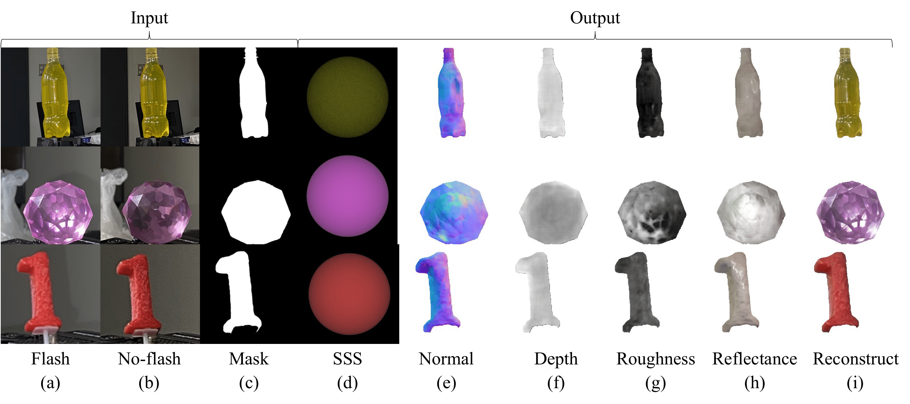

# Inverse Scattering
This is the implementation for the CVPR 2023 paper:

"Inverse Rendering of Translucent Objects using Physical and Neural Renderers"

By [Chenhao Li](https://www.is.ids.osaka-u.ac.jp/author/chenhao-li/ "Chenhao Li"), [Trung Thanh Ngo](https://www.is.ids.osaka-u.ac.jp/author/trung-thanh-ngo/ "Trung Thanh Ngo"), [Hajime Nagahara](https://www.is.ids.osaka-u.ac.jp/author/hajime-nagahara/ "Hajime Nagahara")

[PDF](Files/paper.pdf) | [Dataset]() | [Supplementary document](Files/supp.pdf)

<div  align="center">    

</div>

## Requirements

* Linux
* NVIDIA GPU + CUDA CuDNN
* Python 3
* torch
* torchvision
* dominate
* visdom
* pandas
* scipy
* pillow

## How to use

### Test on the real-world objects
```bash
python ./inference_real.py --dataroot "./datasets/real" --dataset_mode "real" --name "edit_twoshot" --model "edit_twoshot" --eval
```

### Train
- Download the [dataset]().
- Unzip it to ./datasets/
- To view training results and loss plots, run `python -m visdom.server` and click the URL http://localhost:8097.
- Train the model (change gpu_ids according your device)

```bash
python ./train.py --dataroot "./datasets/translucent" --name "edit_twoshot" --model "edit_twoshot" --gpu_ids 0,1,2,3
```

### Test
```bash
python ./test.py --dataroot "./datasets/translucent" --name "edit_twoshot" --model "edit_twoshot" --eval
```

### scripts.sh integrate all commands
```bash
bash ./scripts.sh
```

## Acknowledgements

Code derived and modified from:

- [pix2pix](https://github.com/junyanz/pytorch-CycleGAN-and-pix2pix "https://github.com/junyanz/pytorch-CycleGAN-and-pix2pix")
- [Single-Shot Neural Relighting and SVBRDF Estimation](https://github.com/ssangx/NeuralRelighting "https://github.com/ssangx/NeuralRelighting")
